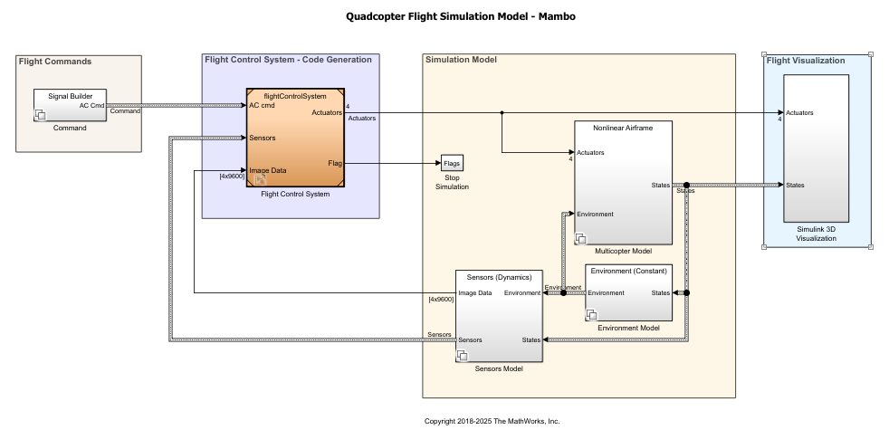

# Autonomous Minidrone Line Follower – MathWorks Virtual Competition 2026

This repository contains the algorithm development and simulation files for an autonomous line-following quadcopter. This project was developed as part of the MathWorks Global Drone Virtual Competition, focusing on real-time computer vision and dynamic flight control within a simulated environment.

*Side-by-side view of the downward-facing camera feed (left) and the 3D flight simulation environment (right).*

## 🏗️ System Architecture & Scope

The project leverages a comprehensive system-level simulation. While the physical dynamics of the Parrot Mambo quadcopter (airframe, environment, and sensor physics) are provided by the MathWorks environment, my primary focus was designing and engineering the **Flight Control System**.

*Top-level system architecture. The custom image processing and path-planning algorithms are housed within the central 'Flight Control System' block.*

## 🧠 Core Algorithm Design

Inside the Flight Control System block, the "brain" of the drone was custom-developed using MATLAB functions integrated with Simulink and Stateflow. 

### 1. Image Processing & Computer Vision
The drone processes the raw video feed from the downward-facing camera to navigate the track:
* **Image Segmentation:** Applied color thresholding algorithms in MATLAB to isolate the target path from the background environment.
* **Centroid Detection:** Calculated the center of mass of the segmented line to generate an accurate positional error signal.

### 2. Path Planning & Control
* **Kinematic Translation:** Translated pixel-space errors from the camera output into physical yaw and roll commands to keep the drone centered over the path.
* **State Machine Logic:** Managed the drone's operational states (Takeoff, Search, Track Follow, Land) using Stateflow to ensure stable and predictable mission execution without crashing.

## 📂 Repository Structure
This project is packaged as a standard MATLAB Project (`.mlproj`) to ensure proper path management and dependency loading.

* `Dagozilla.mlproj` - Main project file to initialize the workspace.
* `work/` and `slprj/` directories are explicitly ignored to keep the repository clean of local build caches.
* Custom MATLAB functions and Stateflow charts can be viewed by opening the model and navigating into the Flight Control System subsystem.

## 🚀 How to Run
1. Clone this repository.
2. Open MATLAB and double-click `Dagozilla.mlproj` to load the project paths.
3. Open the main `.slx` model file.
4. Run the simulation to view the 3D environment and camera feeds.